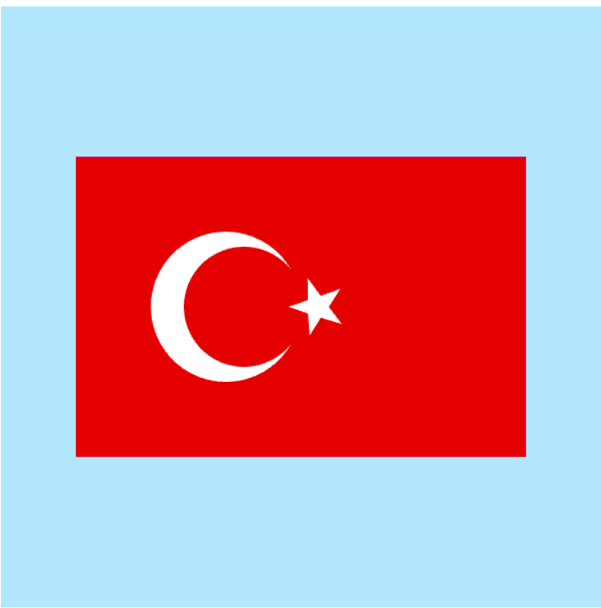

# Turkish-Flag
WebGL and simple drawing

## Crescent:
• 2 circles were drawn to draw a crescent. The parametric equation of a circle was used to create multiple vertices. Parametric equations:
y=sin(angle)
x=cos(angle)
• Increased the angle from 0 to 2*pi to draw the circle.

## Star:
• A pentagon and five triangles were drawn to draw the star.
